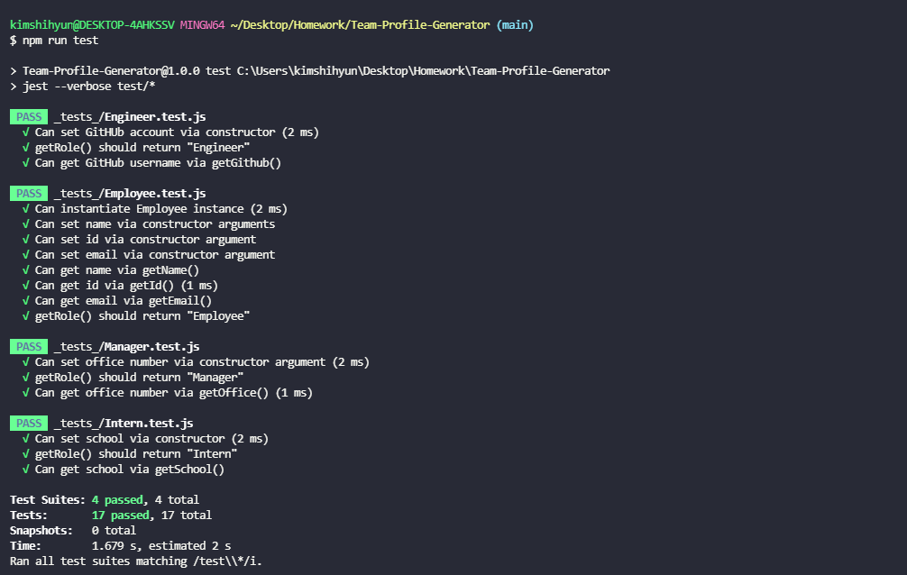
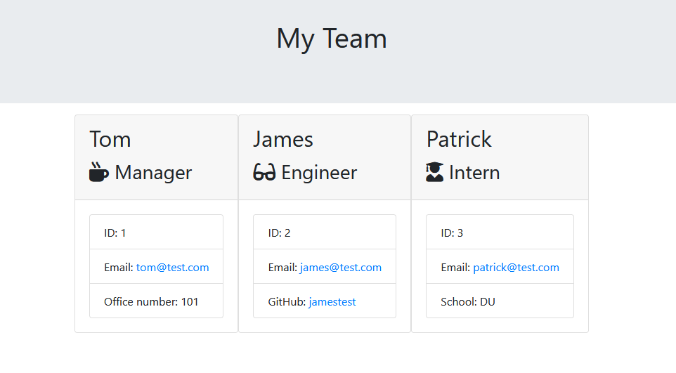

<h1 align="center">Team Profile Generator</h1>

<!-- TABLE OF CONTENTS -->
<details open="open">
  <summary>Table of Contents</summary>
  <ol>
    <li>
      <a href="#about-the-project">About The Project</a>
      <ul>
        <li><a href="#user-story">User Story</a></li>
      </ul>
       <ul>
        <li><a href="#built-with">Built With</a></li>
      </ul>
    </li>
    <li>
      <a href="#links">Links</a>
    <li><a href="#screenshot">Screenshots</a></li>
  </ol>
</details>

## About The Project

Team Profile Generator is a Node.js command-line application that takes in information about employees on a software engineering team. The application generates an HTML webpage that displays summaries for each person on the team. Tests are enabled to make the code maintainable. Tests are written for every part of the code to ensure that it passes each test.

The application won't be deployed, but will have a walkthrough video that demonstrates its functionality and all of the tests passing.

## User Story

```
AS A manager
I WANT to generate a webpage that displays my team's basic info
SO THAT I have quick access to their emails and GitHub profiles
```

## Built With

- [HTML](https://html.spec.whatwg.org/)
- [Javascript](https://www.javascript.com/)
- [Node.js](https://nodejs.org/en/)

## Links

- [Github Repo](https://github.com/KimShiHyun/Team-Profile-Generator)
- [Video Demo](...)

## Screenshot

The following image shows the command-line application's appearance and tests running smoothly:



The following image shows the rendered html file that is created after all employee information is inputed:


